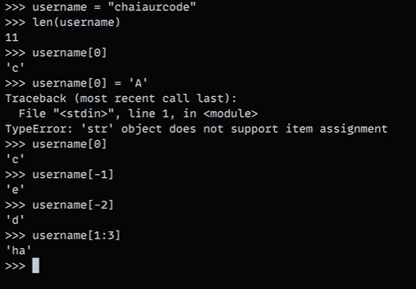
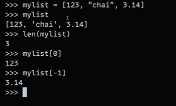
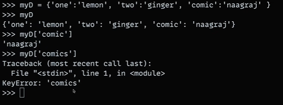
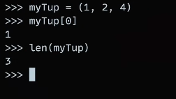

# Object types / Data Types

- Number : 12345, 3.1415, 3+4j, 0b111, Decimal(), Fraction()

- String : "Hello, World!", 'Hello, World!', """Hello, World!"""

- List : [1, [2, 'three'], 4.5], list(range(10))

- Tuple : (1, 'spam', 4, 'U'), tuple('spam'), namedtuple

- Dictionary : {'food': 'spam', 'taste': 'yum'}, dict(hours=10)

- Set : set('abc'), {'a', 'b', 'c'}

- File : open('eggs.txt'), open(r'C:\ham.bin', 'wb')

- Boolean : True, False

- None : None

- Funtions, modules, classes

- Advance: Decorators, Generators, Iterators, MetaProgramming

## math library
` import math` - This will import all the methods and properties from math library.

for e.g. - `math.pi` will generate the value of pi i.e. `3.141592653589793`

## random Library
`import random` - This will import all the methods and properties from random library.

for e.g. - `random.random()` will generate a random value from 0 to 0.9.

for e.g. - `random.choice()` will give me random value from an array `num`.

`random.choice([1, 2, 3, 4, 5])`

OUTPUT : `3 `

## Strings In Python:
- Strings are enclosed in single quotes or double quotes.
- Strings are immutable in pyhton. For ref. check below img.
This image contains few operation on strings.

## List in Python :
- List is a collection of items which are ordered and changeable.
- List is denoted by square brackets `[]`.
- List can contain duplicate values.
- List can contain different data types.
- List is mutable in python. For ref. check below img.
- List is similar to Arrays in js.

## Dictionary in Python:
- Dictionary is a collection of key-value pairs.
- Dictionary is denoted by curly brackets `{}`
- Dictionary is mutable in python.
- Dictionary is similar to Objects in js.

## Tuples in Python:

- Tuples are similar to lists but tuples are immutable in python.
- Tuples are denoted by round brackets `()`

