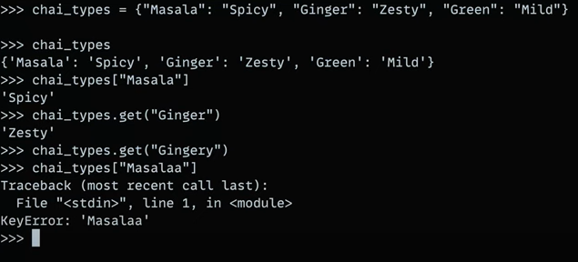
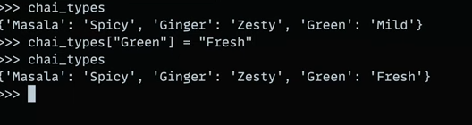
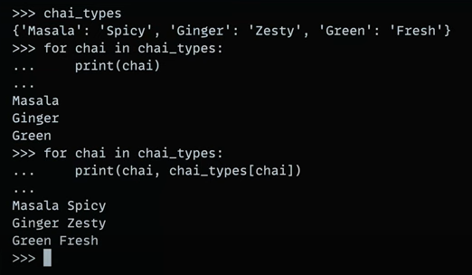
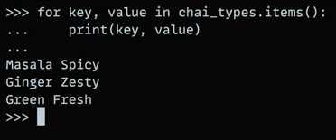
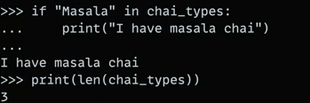
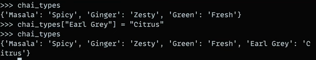
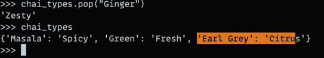
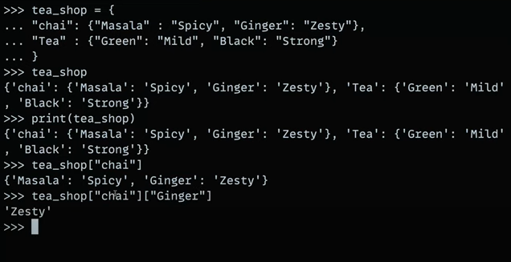
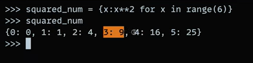
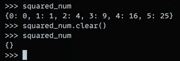

# Dictionaries In Python:

- Creating dictionary :

`chai_types = {'masala':'spicy', 'Ginger:'zesty', 'Green':'Mild'}  `

-  Accessing dictionary :

`chai_types['Masala']` #'Spicy'

OR 

`chai_types.get('Ginger')` #'Zesty'

- Updating values:

- Accessing keys and values:

- Conditionals in dictionaries:

- Inserting new Values:

- Popping elements:

## Nested Dictionaries:

 ## Calculations inside  dictionaries:

 

 ## Emptying a dictionary:

 

