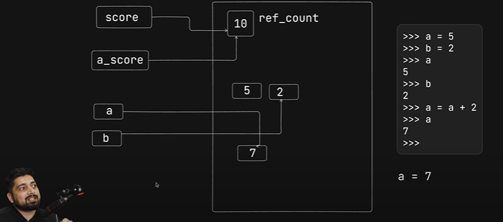
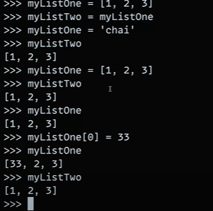

## Internal Working in Python 

In python, `int` and `strings` are specially treated.When the new value is assigned to a variable, the old value( in case of int and string) is not immedietly garbage collected in case, it might be needed again in future.

- The datatypes are not assigned to the variable but to the storing container or reference in the memory itself so we can say that no datatypes are associated with the variables.

- But in cases of other data types, for e.g. lists, it can be mutated easily. Consider the following example:

In this case, the list `myListOne` is a mutable object. When we assign it to a new variable `myListTwo`,
the reference to the same list object is assigned to the new variable `myListTwo`.

 So, both variables are pointing
to the same list object. When we set the list `myListOne` to `'chai'`, it creates another object in the memory and starts pointing to it and the change is not reflected in
the other variable `myListTwo` and it still points to `[1,2,3]`.

Suppose, if we again set the list `myListOne` to `[1,2,3]`, what do you think will the two variables point to the same memory? ---
The answer is no, as in case of data types aside `int` and `str`, the old memory reference is garbage collected if no variable points to it.

