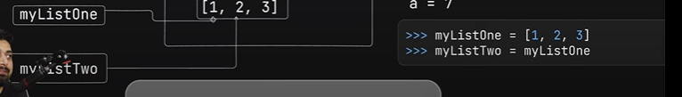

## Internal Working in Python 

In python, `int` and `strings` are specially treated.When the new value is assigned to a variable, the old value( in case of int and string) is not immedietly garbage collected in case, it might be needed again in future.

- The datatypes are not assigned to the variable but to the storing container or reference in the memory itself so we can say that no datatypes are associated with the variables.

- But in cases of other data types, for e.g. lists, it can be mutated easily. Consider the following example:

In this case, the list `myListOne` is a mutable object. When we assign it to a new variable `myListTwo`,
the reference to the same list object is assigned to the new variable `myListTwo`.

 So, both variables are pointing
to the same list object. When we set the list `myListOne` to `'chai'`, it creates another object in the memory and starts pointing to it and the change is not reflected in
the other variable `myListTwo` and it still points to `[1,2,3]`.

Suppose, if we again set the list `myListOne` to `[1,2,3]`, what do you think will the two variables point to the same memory? ---
The answer is no, as in case of data types aside `int` and `str`, the old memory reference is garbage collected if no variable points to it.

Also see the following code snippet:

- Here we took a variable `l1` and assigns it a list `[1,2,3]`. Now again we created a new variable `l2` and points it to `l1` means both are pointing to the same memory reference i.e. `[1,2,3]`. 

- If we trying changing the value at `l1[0]` to `44`. Would it be reflected in `l2` as well? --- The short answer is yes, as both the variables are pointing to the same memory block.

## Slice in Python and its special use Case:
- Python has a special feature called slicing. It allows us to extract a subset of elements from a
sequenlce (like a list, tuple, or string).
- The syntax for slicing is as follows: `list[start:stop:step]`.

- Here, `start` is the index where the slice starts, `stop` is the index where the slice ends, and `step` is the increment between indices.

- If `start` is omitted, the slice starts from the beginning of the sequence. If `stop` is omitted, the slice goes until the end of the list. If `step` is
omitted, it defaults to 1.

- Slicing a list creates a copy in the memory space and therefore referencing to that new copy rather than the super-list.
Consider the following e.g.

## '==' and 'is' Operator in Python:
- The `==` operator checks if the values of two variables are equal. It checks the value
of the variables, not the memory location where they are stored.

- The `is` operator checks if both variables point to the same object in memory. It checks 
the memory location where the variables are stored.

Consider the following e.g.

