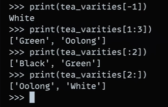

# Lists in python:
- Lists are ordered collections of items that can be of any data type, including strings,  integers, floats, and other lists.
- Lists are denoted by square brackets `[]` and are mutable, meaning they can be modified  after creation.

- Lists are indexed, meaning each item in the list has a corresponding index, which is an integer  starting from 0.

- Lists can be created using the `list()` function, or by enclosing a sequence of items in
square brackets `[]`.

for e.g.:-
`tea varieties =  ["Oolong", "White", "Green", "Black"]`
## methods:
- `append()`: Adds an element to the end of the list.
- `extend()`: Adds multiple elements to the end of the list.

for e.g.:-

`tea_varieties = ["Oolong", "White", "Green", "Black"]`

`tea_varieties.append("Yellow")`

`tea_varieties.extend(["Herbal", "Rooibos"])`

- `insert()`: Inserts an element at a specified position in the list.
for e.g.:-

`tea_varieties = ["Oolong", "White", "Green", "Black"]`

`tea_varieties.insert(1, "Yellow")`

- `remove()`: Removes the first occurrence of an element in the list.
for e.g.:-

`tea_varieties = ["Oolong", "White", "Green", "Black"]`

`tea_varieties.remove("White")`

- `sort()`: Sorts the list in-place.
for e.g.:-

`tea_varieties = ["Oolong", "White", "Green", "Black"]`

`tea_varieties.sort()`

- `reverse()`: Reverses the order of the list in-place.
for e.g.:-

`tea_varieties = ["Oolong", "White", "Green", "Black"]`

`tea_varieties.sort()`

## Slicing in Lists:
- Slicing allows you to extract a subset of elements from a list.
- The general syntax for slicing is `list[start:stop:step]`.

- `start`: The index of the first element to include in the slice.
- `stop`: The index of the last element to include in the slice.

- `step`: The increment between elements in the slice.
for e.g.:-

`tea_varieties = ["Oolong", "White", "Green", "Black"]`

`tea_varieties[1:3]` # Output: ["White", "Green"]

`tea_varieties[1:]` # Output: ["White", "Green", "Black"]

`tea_varieties[:3]` # Output: ["Oolong", "White", " Green"]

`tea_varieties[::-1]` # Output: ["Black", "Green", "White",  "Oolong"]

## we can perform insert, update, delete operation with slicing :
- refer to this following example:

## Looping in Lists:
- We can use a for loop to iterate over the elements of a list.
- The general syntax for a for loop is `for variable in list:`.

- We can also pass the ending operator which is used after each iteration.

### Conditional printing in  lists :
- We can use if-else condition to print the elements of the list based on certain conditions.
- The general syntax for if-else condition is 
`if condition: print(element)`
- refer to this following example:

## Methods in Lists:
- We can use methods to perform various operations on lists.
- The general syntax for methods is `list.method()

- list.pop():
This method  removes and returns the last element of the list.
for e.g.:-
`tea_varieties = ["Oolong", "White", "Green", "Black"]`

`tea_varieties.pop()` # Output: "Black"

- list.insert():
This method inserts the specified element at the specified position in the list.
for e.g.:-

`tea_varieties = ["Oolong", "White", "Green"]`

`tea_varieties.insert(2, "Black")` # Output: ["Oolong",
"White", "Black", "Green"]
- list.append():
This method adds an element to the end of the list.

- list.remove():
This method removes the first occurrence of the specified element from the list.
for e.g.:-

`tea_varieties = ["Oolong", "White", "Green", "Black"]`

`tea_varieties.remove("White")` # Output: ["Oolong", "Green",  "Black"]

- list.copy():
This method returns a copy of the list.
for e.g.:-
`tea_varieties = ["Oolong", "White", "Green", "Black"]`

`tea_varieties_copy = tea_varieties.copy()` # Output: ["Oolong",  "White", "Green", "Black"]

## Calculations inside lists:

