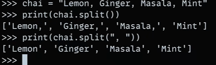
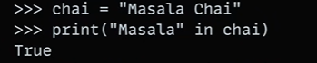

# Strings in python:
-  Strings are immutable in python, meaning that once a string is created, it cannot be changed.
-  Strings are sequences of characters, and they can be indexed and sliced like lists.
- for e.g.:-

    `str = 'lemon tea'`

    `first_char = str[0]`

    `print(first_char)  # prints 'l'`

-  Strings can be concatenated using the `+` operator, or using the `join()` method.
-  Strings can be repeated using the `*` operator.

## Slicing in python:
-  Slicing is a way to extract a subset of characters from a string.
-  It is done using the `[]` operator, and it takes two parameters: the start
index and the end index.
-  for e.g.:-

`str = 'lemon tea'`

`print(str[1:4])  # prints 'emo'`
-  If the start index is omitted, it defaults to 0.
-  If the end index is omitted, it defaults to the length of the string.
-  Slicing can also be used to extract a subset of characters from a string in reverse order
by using a negative start index.
-  for e.g.:-

`str = 'lemon tea'`

`print(str[-3:])  # prints 'tea'`
-  Slicing can also be used to extract a particular gap  of characters from a string.
-  for e.g.:-

`str = 'lemon tea'`

`print(str[1:5:2])  # prints 'emo'`
-  The third parameter in the slicing operation is the step size, which specifies the gap between the
characters to be extracted.

## String Methods in python:

-  1. `str.upper()`: Returns a string where all characters are in uppercase.
-  2. `str.lower()`: Returns a string where all characters are in lowercase.
-  3. `str.title()`: Returns a string where the first character of each word  is in uppercase and the rest are in lowercase.
-  4. `str.capitalize()`: Returns a string where the first character is in uppercase
and the rest are in lowercase.

- 5. `str.strip()` :  Returns a string where all leading and trailing whitespaces are removed.
for e.g.:-

`str = '   hello   '`

`print(str.strip())  # prints 'hello'`

- 6. `str.replace` :    Returns a string where all occurrences of a specified value are replaced with another value.
for e.g.:-

`str = 'hello world'`

`print(str.replace('world', 'python'))  # prints 'hello python'`

- 7. `str.split()` :   Returns a list of words in the string, using  space as the separator.
for e.g.:-

`str = 'hello world'`

`print(str.split())  # prints ['hello', 'world']`

- 8. `str.find()` :     Returns the index of the first occurrence of a specified value.
for e.g.:-

`str = 'hello world'`

`print(str.find('world'))  # prints 6`

- 9. `str.count()` :   Returns the number of occurrences of a specified value.
for e.g.:-

`str = hello hello  world'`

`print(str.count('hello'))  # prints 2`

- 10. `str.startswith()` :   Returns True if the string starts with the specified value , otherwise False.
for e.g.:-

`str = 'hello world'`

`print(str.startswith('hello'))  # prints True`

## Order formatting in python:
- 1. `str.format()` :   Returns a formatted string.
for e.g.:-

`str = 'hello {}'`

`print(str.format('world'))  # prints 'hello world'`

- 2. `join()`  :   Returns a string concatenated with the elements of an iterable.
for e.g.:-

`str = ', '.join(['hello', 'world'])`

`print(str)  # prints 'hello, world'`

 

