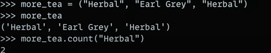
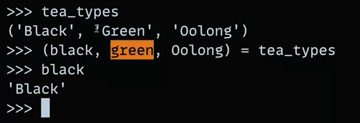

# Tuples in python:

- Unlike Lists,  Tuples are immutable, meaning their values cannot be changed after creation.
- Tuples are defined by enclosing elements in parentheses `()` instead of square brackets `[]`.
- Tuples can be nested, meaning they can contain other tuples as elements.
- Tuples are faster and more memory-efficient than lists.

- Creating a  Tuple:

`tea_types = ("Black", "Oolong", "Green")`

- Accessing Tuple Elements:

`tea_types[0]` #  Output: "Black"

`tea_types[-1]` #  Output: "Green"

- #### slicing is same as lists

- Lists and tuples can both contain duplicate  values and values of different data types.

## Tuple destructuring:
Tuple destructuring is a feature in Python that allows you to unpack the values of a tuple into separate 
variables. This can be useful when you need to assign the values of a tuple to multiple variables in  a single line of code.

for e.g.:

